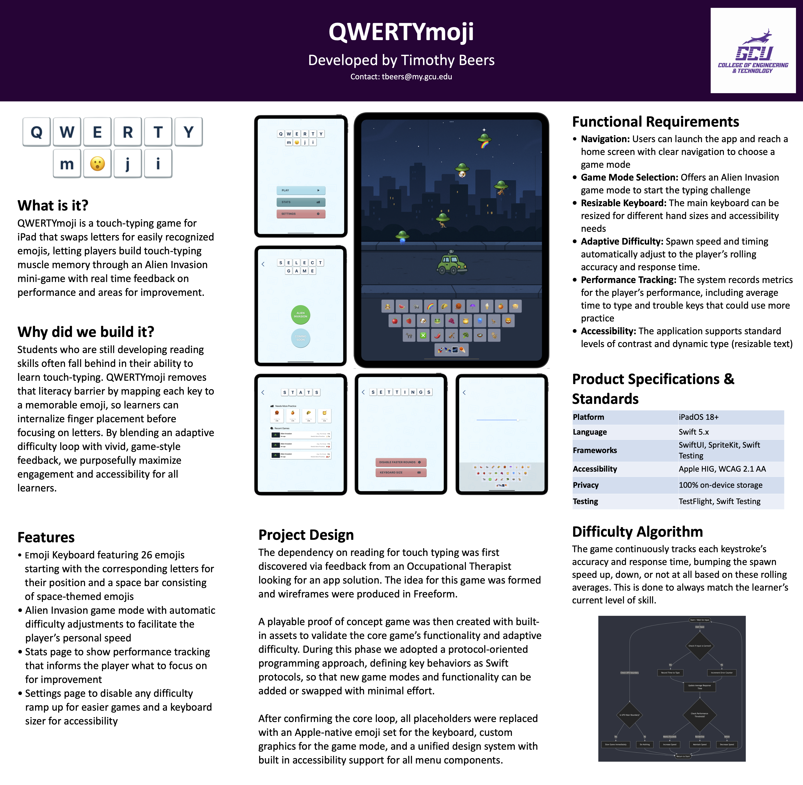

# QWERTYmoji


This project delivers an iPad-based typing game specifically designed to help children with reading disabilities develop touch typing skills. Built with Swift, SwiftUI, and SpriteKit.

---

## Contents

- [Demo](#demo)
- [Quick start](#quick-start)
- [Project overview](#project-overview)
- [Documentation](#documentation)
- [Requirements assessment](#requirements-assessment)
- [Planned improvements](#planned-improvements)
- [Testing](#testing)
- [Showcase poster](#showcase-poster)
- [Contact](#contact)

---

## Demo

- Screencast presentation:
  - Part 1 (application demo): [Loom Link](https://www.loom.com/share/3b6c4b9591b144bc8b12be876d80aa8e?sid=15b0545e-39e8-4de4-ba7b-29fd81bb5909)
  - Part 2 (implementation overview): [Loom Link](https://www.loom.com/share/9eebac71b6604458bf712e81e5d2f7ac?sid=391e5122-ad78-4ba4-b60f-53881012f398)

---

## Quick start

Full setup guide: **[docs/setup.md](docs/setup.md)**

Clone and open:

```bash
    git clone https://github.com/timothybeers02/QWERTY.git
    cd QWERTYmoji
    xed QWERTYmoji.xcodeproj
    # Select an iPad simulator and press Run (⌘R)
```

Requirements

- Xcode 15 or newer
- iPad simulator runtime installed

---

## Project overview

QWERTYmoji is an iPad typing game that teaches touch-typing without relying on letter recognition. A QWERTY-layout emoji keyboard replaces letters so learners can build motor patterns first, making the experience accessible to students who struggle with reading.

**How it works**  
The core “Alien Invasion” mode is built with SwiftUI (UI) and SpriteKit (real-time gameplay). UFOs descend with emoji targets; when the learner taps the matching emoji, the scene reacts with animations and the system records timing. Difficulty adapts automatically based on recent performance, keeping the pace encouraging rather than punitive. All performance data (e.g., time-to-type) is stored locally on-device; the app makes no network calls.

**Architecture at a glance**  
A modular design keeps features testable and easy to extend:
- **Emoji Keyboard** (QWERTY-style, resizable)
- **Keyboard Observer** (captures taps)
- **Game Controller View** (bridges UI ↔ SpriteKit scene)
- **SpriteKit Game Scene** (Alien Invasion logic/animations)
- **Performance Tracking** (time-to-type and aggregates)
- **Settings & Stats** (difficulty controls, summaries)

**Key capabilities**
- Emoji-first QWERTY keyboard with adjustable size
- Adaptive difficulty that responds to accuracy and speed
- Stats page with time-to-type per emoji and averages
- Local-only data storage for privacy and simple deployment
- iPad-first layouts targeting iPadOS 18+

---

## Documentation

Final artifacts included in the repository:

- Project Proposal → **[docs/ProjectProposal.docx](docs/ProjectProposal.docx)**
- Requirements Document → **[docs/ProjectRequirements.docx](docs/ProjectRequirements.docx)**
- Architecture Plan → **[docs/ArchitecturePlan.docx](docs/ArchitecturePlan.docx)**
- Traceability and Testing → **[docs/TraceabilityAndTesting.docx](docs/TraceabilityAndTesting.docx)**
- Showcase Poster → **[docs/ShowcasePoster.pdf](docs/ShowcasePoster.pdf)**
- Setup Guide → **[docs/setup.md](docs/setup.md)**

---

## Planned improvements

- Higher quality in-game assets
- Soundtrack and audio feedback
- Additional UI Polish and implementation of new iPadOS 26 design standards
- Additional game modes

---

## Testing

How to run tests

- Xcode: Product → Test (⌘U)
- Command line:

```bash
      xcodebuild \
        -scheme QWERTYmoji \
        -destination 'platform=iOS Simulator,name=iPad Pro (11-inch)' \
        test
```

Traceability and manual testing strategy are documented in  
**[docs/TraceabilityAndTesting.docx](docs/TraceabilityAndTesting.docx)**

---

## Showcase Poster

Poster showing a visual summary of the project:

- **[docs/ShowcasePoster.pdf](docs/ShowcasePoster.pdf)**

Preview:



---

## Contact

- Author: Timothy B.
- Email: **tbeers@my.gcu.edu**

